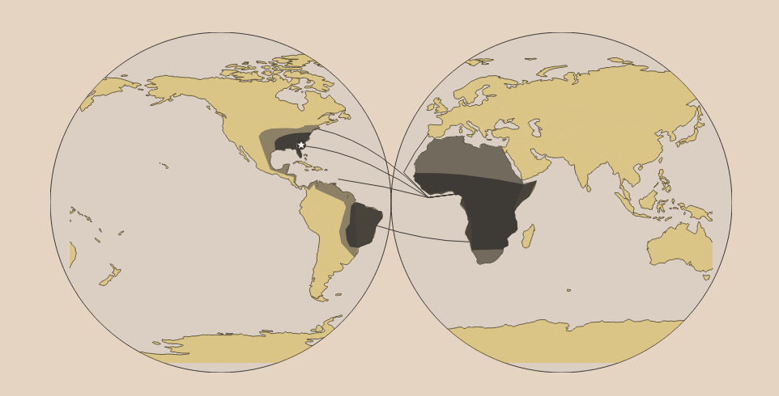
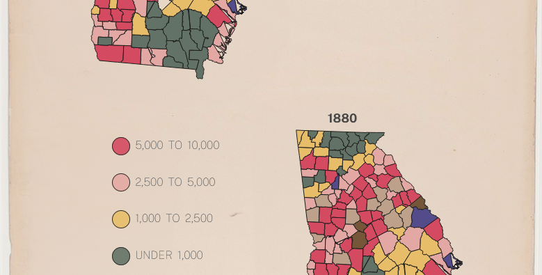
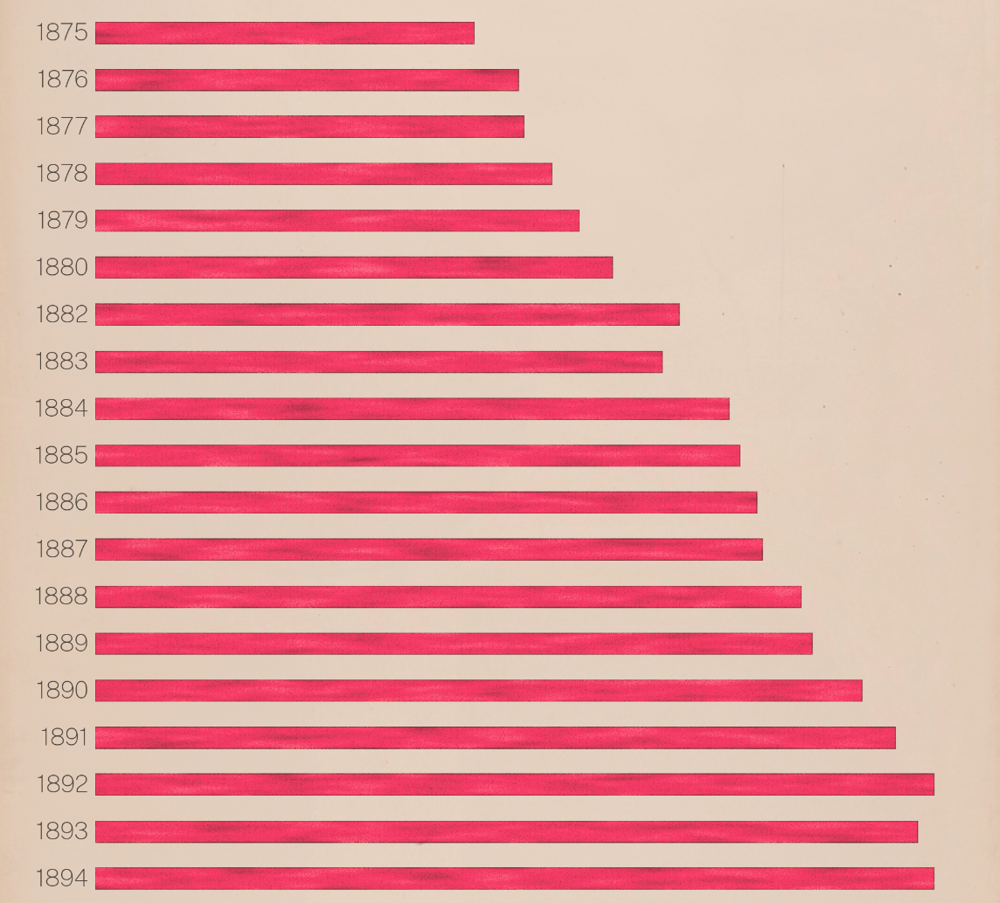
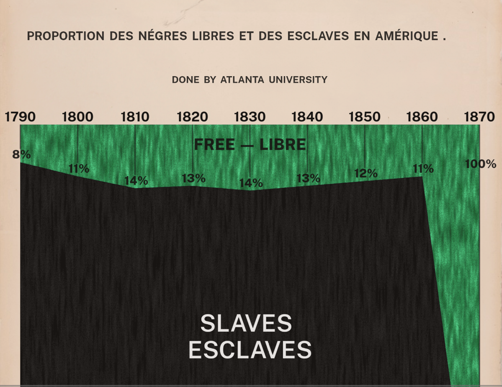

# Du Bois Visualization Challenge

Recreating W.E.B. Du Bois' pioneering 1900 data visualizations with modern web technologies — built with SvelteKit, D3.js, and hand-crafted SVG.

Part of the [2024 W.E.B. Du Bois Challenge](https://github.com/ajstarks/dubois-data-portraits/tree/master/challenge/2024) by Anthony Starks.

### **[View Live Site](https://duboischallenge.netlify.app/)**

---

<p align="center">
  
  <br />
  <em>Challenge 4 — "The Georgia Negro." Twin globe projection of transatlantic slave trade routes.</em>
</p>

---

## About

[W.E.B. Du Bois](https://en.wikipedia.org/wiki/W._E._B._Du_Bois) was a Black American sociologist at the turn of the 20th century. Through his academic work, he challenged the notions that Black Americans were responsible for the prevailing social inequities they faced. He pioneered methods of data visualization to communicate this message clearly to scientists around the globe — most notably in the series of hand-drawn plates he presented at the 1900 Paris Exposition.

The [Du Bois Challenge](https://github.com/ajstarks/dubois-data-portraits/tree/master/challenge/2024) invites modern data practitioners to recreate these historic visualizations using today's tools. This project takes on that challenge using SvelteKit and D3.js, translating Du Bois' hand-drawn plates into interactive, animated SVG visualizations for the web.

This is both a skill development exercise — pushing the boundaries of what's possible with Svelte 5, D3 geographic projections, and SVG filter pipelines — and an effort to draw attention to the work of a hugely significant scientist whose visual storytelling was a century ahead of its time.

> **Note:** Several visualizations preserve historical language from Du Bois' original 1900 study in their titles and labels.

## Visualizations

### Challenge 1 — Negro Population of Georgia by Counties, 1870-1880

<p align="center">
  
</p>

Two side-by-side choropleth maps showing how Georgia's Black population shifted across counties between 1870 and 1880. Population size in each county is denoted by color, with interactive hover to inspect individual counties.

**Techniques:** D3 `geoAlbers` projection, ordinal color scales (`d3-scale`), GeoJSON county boundaries with Turf.js `rewind`, Svelte `$state`/`$derived` for reactive hover interactions.

---

### Challenge 2 — Slaves and Free Negroes

A stacked area chart depicting the proportion of the Black population in the US that were free versus enslaved between 1790 and 1870. The two areas stack to show the stark imbalance that persisted until emancipation.

**Techniques:** D3 `scaleLinear` for axes, `d3-interpolate` for smooth area fills, CSV data loading via `d3-fetch`, Svelte `$state`/`$derived` for reactive scale and path computation.

---

### Challenge 3 — Acres of Land Owned by Negroes in Georgia

<p align="center">
  
</p>

A horizontal bar chart showing the steady rise of Black land ownership over 25 years (1874-1899) — a nearly threefold increase from 338,769 to over 1 million acres. Hover highlights individual bars for inspection.

**Techniques:** Custom SVG filter pipeline (`feTurbulence` + `feColorMatrix` + blend modes) producing a hand-drawn marker aesthetic faithful to Du Bois' originals. D3 `scaleLinear`, Svelte `$props`/`$derived` for data flow.

---

### Challenge 4 — The Georgia Negro: Slave Trade Routes

<p align="center">
  
</p>

A twin-globe visualization showing the routes of the transatlantic slave trade and the location of Georgia. Animated route lines draw across the projection with Svelte transitions, and destination regions fade into view.

**Techniques:** D3 `geoEquirectangular` projection, SVG `<clipPath>` for globe masking, Svelte `draw` and `fade` transitions for animated data storytelling, TopoJSON + Turf.js for geographic data processing. Restart button re-triggers the full animation sequence.

---

### Challenge 9 — Proportion of Freemen and Slaves Among American Negroes

<p align="center">
  
</p>

A stacked area chart with bilingual labels (English and French, as in Du Bois' original) showing that few Black Americans enjoyed freedom until 1870. Percentage labels and year divisions mark the shifting proportions.

**Techniques:** D3 `area`/`line` generators with `curveLinear` (`d3-shape`), SVG marker filters in two color variants for the hand-drawn texture, `<clipPath>` for area boundaries, Svelte `$props`/`$derived` for reactive data binding.

---

## Technical Highlights

| Technique | Details |
|---|---|
| Svelte 5 Runes | `$state`, `$derived`, `$props` for fine-grained reactivity across all visualizations |
| D3 Geographic Projections | Albers (choropleth), Equirectangular (twin globes) via `d3-geo` |
| SVG Filter Pipeline | `feTurbulence` + `feColorMatrix` + blend modes for hand-drawn marker aesthetic |
| SVG clipPath | Circular globe masking and area chart boundaries |
| Animated Data Storytelling | Svelte `draw` and `fade` transitions on trade route paths |
| Responsive SVG | `bind:clientWidth` for viewport-adaptive layouts |
| Geographic Data Processing | TopoJSON for efficient map data, Turf.js for GeoJSON polygon winding |
| mdsvex | Markdown + Svelte components for narrative-driven challenge pages |

## Tech Stack

- **SvelteKit 2.5** + **Svelte 5** — framework and component model
- **D3.js** — d3-geo, d3-scale, d3-shape, d3-interpolate, d3-fetch, d3-array
- **TopoJSON** + **Turf.js** — geographic data formats and transformations
- **TailwindCSS** + custom SVG filters — styling and hand-drawn visual effects
- **mdsvex** — Markdown preprocessing for narrative content pages
- **Netlify** — hosting and deployment
- Built on the [yuyutsu](https://github.com/sharu725/yuyutsu) SvelteKit template by [@sharu725](https://github.com/sharu725)

## Getting Started

```bash
# Clone the repository
git clone https://github.com/MokeEire/du-bois-challenge.git
cd du-bois-challenge

# Install dependencies
npm install

# Start development server
npm run dev

# Build for production
npm run build

# Preview production build
npm run preview
```

## Acknowledgments

- [Du Bois Data Portraits](https://github.com/ajstarks/dubois-data-portraits) challenge and data by Anthony Starks
- [W.E.B. Du Bois' Staggering Data Visualizations Are as Powerful Today as They Were in 1900](https://nightingaledvs.com/w-e-b-du-bois-staggering-data-visualizations-are-as-powerful-today-as-they-were-in-1900-part-1/) — Nightingale (Data Visualization Society)
- [The Typography of W.E.B. Du Bois](https://www.cooperhewitt.org/2023/02/23/the-typography-of-w-e-b-du-bois/) — Cooper Hewitt, Smithsonian Design Museum
- [yuyutsu](https://github.com/sharu725/yuyutsu) SvelteKit template by [@sharu725](https://github.com/sharu725)

## Author

**Mark Barrett** — [LinkedIn](https://www.linkedin.com/in/mark-barrett-/) · [GitHub](https://github.com/MokeEire)

## License

[MIT](https://github.com/MokeEire/du-bois-challenge/blob/main/LICENSE)
